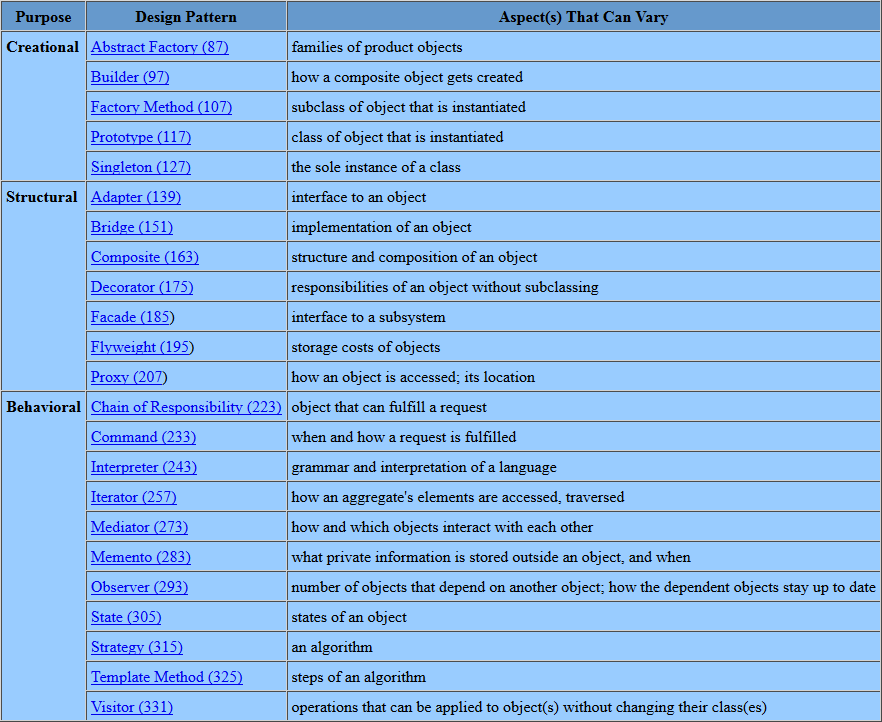
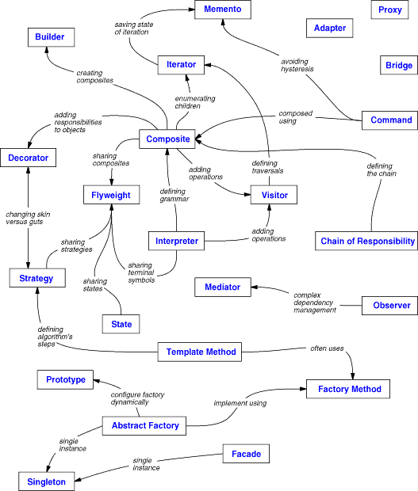

# Design patterns : modèles de conception 

## Définition

Concevoir un logiciel objet c'est bien. Mais concevoir un logiel objets 
**réutilisable**, c'est mieux ! Une conception doit être spécifique au problème 
à résoudre, mais aussi assez générale pour répondre aux problèmes et 
exigences futures.  
Les concepteurs expérimentés ne résolvent pas un problème en partant des 
mécanismes de base, mais réutilisent des solutions qui ont fait leurs preuves : 
les **modèles de conception**. 

## Règles à suivre 

On doit protéger son code en l'encapsulant le plus possible.   
Il faut programmer pour une interface, et non pour un développement. En fait, 
l'abstraction est la clé d'une conception souple et réutilisable.  
Il faut préférer la composition d'objets à l'héritage de classes. 
On cherche à déléguer le plus possible : une classe doit, de préférance, ne faire 
qu'une seule chose. 

## Défauts courants 

Cette liste répertorie les défauts plus courants d'une conception à objets, ainsi 
qu'un modèle adapté à la résolution de ce problème : 

- Créer un objet en spécifiant explicitement sa classe (*Factory, Abstract 
Factory, Prototype*)
- Assujetissement à une opération particulière (*Chain of responsability, 
Command*)
- Dépendance vis à vis des plate-formes matérielles et logicielles (*Abstract 
Factory, Bridge*)
- Assujetissement à la représentation d'un objet ou à son code (*Abstract 
Factory, Bridge, Memento, Procuration*)
- Assujetissement à un algorithme (*Builder, Iterator, Strategy, Template 
method, Visitor*)
- Couplage fort (*Abstract Factory, Bridge, Chaine of responsability, Command, 
Facade, Mediator, Observer*)
- Extension des fonctionnalités par sous-classe (*Bridge, Chaine of responsability, 
Composite, Decorator, Observer, Strategy*)
- Impossibilité de modifier convenablement des classes (*Adapter, Decorator, 
Visitor*)

## Choisir un modèle 

## Liens entre modèles 

