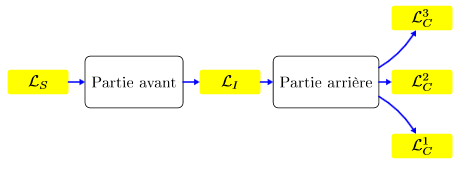

# Compilation Avancée - Cours 1 : La compilation

## Qu'est-ce que la programmation ?

La **programmation** est l'art de *résoudre des problèmes** efficacement, par
le *calcul*. Certains problèmes sont simples à résoudre, d'autres difficiles.
Certains problèmes ont une solution connue, d'autres pas. La description aussi
peut varier grandement.  
On peut toujours **spécifier** un problème avec une formule logique :  
```∀I, P(I) ⇒ ∃O, Q(I,O)```
avec *P* la **précondition** (les entrées valides) et *Q* la
**postcondition** (relation attendue entre entrées et sorties).  

Entre la spécification du problème et la résolution par la machine, le
programmeur doit expliciter le problème via le *langage de programmation*, qui
introduit des mécanismes de calcul plus **abstraits** et éloignés de la
machine.  

Le programmeur peut faire des **erreurs** de différents types :

- les erreurs de *fonctionnement* apparaissent lors d'une opération illicite,
qui empêche l'obtention d'un résultat. Il faut s'assurer que les opérations
faites par la machine ont un **sens**.
- les erreurs de **correction** apparaissent quand le programme produit un
résultat, mais que celui-ci n'est pas conforme à la spécification. Il faut
**raisonner** sur le programme.

## Sémantique et syntaxe

Il faut donner une interprétation univoque et indépendante du langage : la
**sémantique**

- la sémantique dénotationelle interprète un programme dans un espace
mathématique
- la sémantique opérationnelle donne une description du calcul

Une fois la sémantique définie, on peut écrire un **interprète** qui permet
d'exécuter tout programme dans le langage dont on a défini la sémantique.

Dans le cadre du cours, on s'intéresse à la sémantique opérationnelle, dont
les règles sont données vis à vis d'une *syntaxe*.  
Il y a deux syntaxes, spécifiées par des grammaires. La syntaxe *concrète* est
un langage de mots, la syntaxe *abstraite* est un langage d'arbres. C'est
l'*analyse syntaxique* qui fait le lien en associant un arbre à tout mot du
langage de la syntaxe concrète.  

La sémantique opérationnelle est spécifiée par des **jugements** :  
  
La sémantique à **petits pas** associe un terme au terme obtenu à l'étape
suivante du calcul.  
La sémantique à **grands pas** associe un terme à son résultat.  

Interprétation en OCaml :  
```
(* la syntaxe *)
type t =
| Int of int
| BinOp of t * binop * t
and
binop = Add | Sub | Mul | Div

(* sémantique à petits pas *)
let rec step : t -> t = function
 | Int _ -> None
 | BinOp (Int m, Add, Int n) -> Some (Int (m+n))
 | BinOp (Int m, Mul, Int n) -> Some (Int (m*n))
 | BinOp (Int m, Div, Int n) -> Some (Int (m/n))
 | BinOp (Int m, Sub, Int n) -> Some (Int (m-n))
 | BinOp (Int m, op, e') -> Some (BinOp (Int m, op, step e'))
 | BinOp (e, op, e') -> Some (BinOp (step e, op, e'))

(* sémantique à grands pas *)
type value = int

let rec eval : t -> value = function
 | Int x -> x
 | BinOp (e, Add, e') -> eval e + eval e'
 | BinOp (e, Mul, e') -> eval e * eval e'
 | BinOp (e, Div, e') -> eval e / eval e'
 | BinOp (e, Sub, e') -> eval e - eval e'
```

## Machines

Les différents langages de programmation ont des **modèles de calcul**
différents. Une **machine abstraite** décrit l'environnement et les règles
d'évaluation d'un tel modèle. Il n'y a en général pas de réalisation physique,
mais des **émulations** à l'aide d'un autre programme : une **machine
virtuelle**.  

Toutefois, l'émulation d'une machine est *peu efficace* car pour chaque
opération, il y a une couche de traduction. On va utiliser un **compilateur**.

## Compilateur

Un **compilateur** va traduit un programme écrit dans le *langage source* vers
un programme équivalent écrit dans un *langage cible* que la machine virtuelle
peut faire tourner plus efficacement.  
La précondition d'un compilateur est la *bonne formation* des programmes
d'entrée.  
La postcondition essentielle est la *préservation de la sémantique*.  

Une architecture courant consiste à séparer le compilateur en deux
sous-compilateurs.  
  
La **partie avant** traduit le programme d'un langage source vers le *langage
intermédiaire*, la **partie arrière** traduit le programme en langage
intermédiaire vers un **langage cible**.  
Le choix du langage intermédiaire est crucial.
