# Compilation Avancée - Cours 2 : Compilation d'un langage de premier ordre

## Le flot de contrôle

Un programme utilie produit généralement un résultat **en fonction** de ses
entrées.  
On va donc étendre le langage des expressions arithmétiques :  
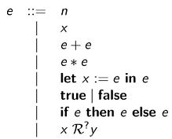  
La dernière ligne correspond à la décision d'une propriété. On
choisit ```R ∈ {<, >, ≤, ≥, =}```.  
Le résultat *v* de l'évaluation d'une expression peut être *n*, *true* ou
*false*.  
Voici la sémantique opérationnelle à grands pas :  
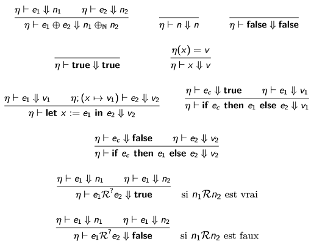  

Les valeurs en OCaml :  
```
type value =
| VInt of int
| VBool of bool

exception NotInt

let as_int = function
| VInt x -> x
| _ -> raise NotInt

exception NotBool

let as_bool = function
| VBool b -> b
| _ -> raise NotBool
```
L'AST :  
```
type binop = Add |Mul | Div | Sub
type comparison = Le|Ge|Lt|Gt|Eq
type variable = string
type t =
| Int of int
| Bool of bool
| Binop of binop * t * t
| Let of variable * t * t
| Var of variable
| If of t * t * t
| Dec of comparison * t * t

let comparison = function
| Le -> (<=)
| Ge -> (>=)
| Lt -> (<)
| Gt -> (>)
| Eq -> (=)
```
L'interprète en OCaml :  
```
let rec eval env = function
| Int i -> VInt i
| Bool b -> VBool b
| Binop (op, e1, e2) -> VInt ((binop op) (as_int (eval env e1)) (as_int (eval env e2)))
| Let (x, e1, e2) -> eval (Env.bind env x (eval env e1)) e2
| Var x -> Env.lookup env x
| Dec (c, e1, e2) -> VBool((comparison c) (as_int (eval env e1)) (as_int (eval env e2)))
| If (c, e1, e2) -> if as_bool (eval_env c) then eval env e1 else eval env e2
```


### Typage

Le **typage** permet d'exclure des programmes qu'on sait incorrects par
certaines propriétés, notamment le blocage de certaines expressions.  
Un **jugement de typage** ```Γ ⊢ e:τ``` se lit "sous l'environnement de typage
*Γ*, l'expression *e* a le type *τ*".  
On doit définir des **règles de typage** :  
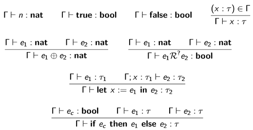  
On note que le type de *x* dans ```let``` peut être déduit de celui de *e1*.  
Typage en OCaml :  
```
let rec type_check env = function
| Var x -> TyEnv.lookup env x
| Int _ -> TInt
| Bool _ -> TBool
| If (cond, e1, e2) ->
  let tycond = type_check env e1 in
  type_check (TyEnv.bind env x ty1) e2
| Binop (_, e1, e2) ->
  let ty1 = type_check env e1 and ty2 = type_check env e2 in
  if (ty1 != TInt || ty2 != TInt) then raise IIITyped;
  TInt
| Dec (_, e1, e2) ->
  let ty1 = type_check env e1 and ty2 = type_check env e2 in
  if (ty1 != TInt || ty2 != TInt) then raise IIITyped;
  TBool
```

### Compilation vers une machine virtuelle

En cas de branchement, on ne veut exécuter qu'un *sous-ensemble* des
instructions, au lieu de toutes les évaluer de la première à la dernière.  
C'est le rôle des **opérateurs de flots de contrôle**.  
Langage de la machine virtuelle :  
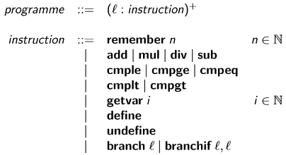  
Les étiquettes *l* sont des noms pour les emplacements des instructions dans
le programme. *branch* et *branchif* sont des opérateurs de contrôle.  

La pile de la machine virtuelle est influencée par ces opérateurs de
contrôle : ```instruction: (pc, ζv, ζr) -> (pc', ζv', ζr')```.  

Sémantique (petits pas) des instructions :  
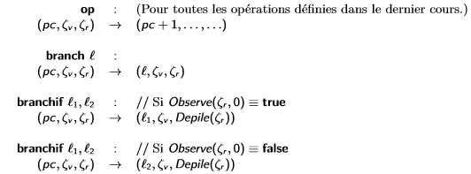  

Interprète en OCaml :  
```
let rec eval_instr labels vm = function
| Branch l -> goto labels vm l
| Branchif (l1, l2) ->
  let x = Stack.inspect 0 vm.val_stack in
  let vm = {vm with val_stack = Stack.pop vm.val_stack}
  in
  (match x with
    | VBool true -> goto labels vm l1
    | VBool false -> goto labels vm l2
    | _ -> raise NotBool)
| ...
and goto labels vm l =
  eval_instr labels vm (snd (vm.prog.(pos_of_label labels l)))
```

## Les fonctions

Une **fonction** est un fragment de code indépendant du reste du programme.
Elle possède un **point d'entrée unique** et peut avoir des arguments formels
qui la **paramètrent**. Une fonction **redonne le contrôle** à son appelant
lorsque le calcul est terminé. Les arguments formels ne sont pas modifiables
de l'extérieur, ce qui garantit la *modularité*.  
Dans un langage de premier ordre, l'ensemble des fonctions est **fixé** dans
le code source du programme et n'évolue pas au cours de son évaluation.  

Nouveau langage :  
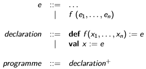  

Sémantique opérationnelle :  
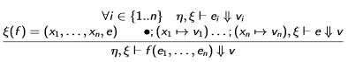  
De nouveau, il suffit d'une analyse associant un nom de fonction à son corps
et l'ensemble de ses arguments formels.  

Un appel de fonction peut **bloquer** si :

* le nom de la fonction est indéfini, une analyse de la bonne liaison des noms
dans le dictionnaire permet de le vérifier
* l'arité de la fonction est incorrect, on associe alors une **signature** pour
s'assurer que le nombre ou les types des arguments effectifs sont corrects.

Les signatures de fonctions suivent cette syntaxe :
```σ ::= τ ⨯ .. ⨯ τ → ⨯``` avec τ de type *int* ou *bool*.  
Si on suppose l'existence d'un dictionnaire de signatures Σ, on étend le
jugement de typage : ```Σ,Γ ⊢ e:τ```.  

Règles de typage des appels de fonction :  
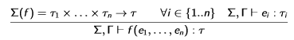  
On veut maintenant s'assurer qu'une signature donnée est correcte pour une
fonction. On définit le jugement unique :  
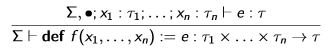  

Ce dictionnaire des signatures peut être obtenu :

* par des **annotations de type**, étendant la syntaxe du langage (```def```)
* par un algorithme d'**inférence de type**

### Des fonctions à la machine virtuelle

On suppose que les programmes sont bien typés.  
Un appel *f(e1, ... en)* fait un va-et-vient avec le flot de contrôle :

* l'**appelant** donne le contrôle au corps de la fonction
* le corps de la fonction est évalué
* le contrôle est rendu à l'appelant

L'instruction de branchement va être utile.

Traduction correcte :
```
C(f(e1,...,en)) =
    C(e1)
    define
    ...
    C(en)
    define
    remember l
    branch lf
l:  ...

C(def f(x1,...,xn)=e)=
lf: C(e)
    undefine
    ...(n fois)...
    undefine
    swap
    ubranch
```
On a dû introduire de nouvelles instructions pour la machine virtuelle :

* *remember l* permet de pousser des étiquettes sur la pile
* *ubranch* est un branchement inconnu, l'adresse étant fournie par le sommet
de la pile
* *swap* échange les deux éléments au sommet de la pile
* *exit* stoppe la machine

**Remarque :** il y a beaucoup d'empilements et de dépilements, et chaque fois
on alloue / désalloue un petit espace mémoire. On voudrait pouvoir pré-allouer
l'espace de pile nécessaire à l'évaluation d'une expression.  
Nombre maximal de variables nécessaires :  
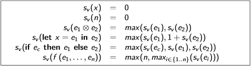  
Nombre maximal de résultats temporaires :  
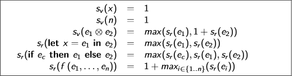  

On a de nouveau besoin d'étendre la machine virtuelle :

* alloc_vstack N : alloue un bloc de taille N au sommet de ζv
* alloc_rstack N : alloue un bloc de taille N au sommet de ζr
* free_vstack : désalloue le bloc au sommet de ζv
* free_rstack : désalloue le bloc au sommet de ζr

Où placer ces instructions ?

* Avant un appel de fonction *f(e1,...,en)=e* :
  - on évalue *e1,...,en* ce qui empile des valeurs *v1,...vn* au sommet de ζr
  - on pré-alloue un bloc de taille *n+sv(e)* au sommet de ζv, et un bloc de
    taille *sr(e)* au sommet de ζr
  - on déplace les *v1,...,vn* du second bloc de ζr au premier bloc de ζv
* A la sortie de la fonction :
  - on déplace la valeur au sommet de ζr vers le sommet du second bloc de ζr
  - on désalloue les deux blocs
* On a la garantie que la fonction ne modifiera que ces deux blocs

#### Blocs d'activation

On peut **factoriser les deux piles** en une seule : les deux blocs pré-alloués
se fusionnent en un unique bloc (le **bloc d'activation d'une fonction**) qui
contient deux sous-blocs ayant des positions connues.  
On en profite pour stocker l'adresse de continuation du calcul.  

L'agencement des sous-blocs est un peu astucieux :  
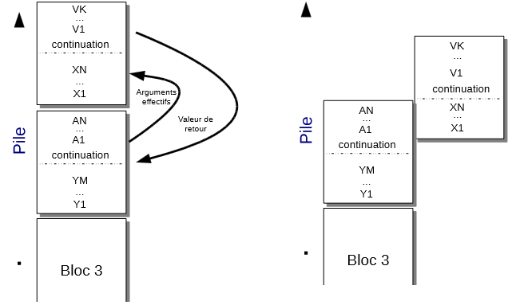  
On peut implémenter le passage des arguments en incrémentant l'entier
représentant le sommet de la pile. On doit toutefois toujours recopier la
valeur de retour de la fonction.  
On étend encore une fois la machine virtuelle :  

* *alloc_stack N, M* : alloue un bloc d'activation de taille M débutant par un
espace réservé pour N variables locales
* *shift K* : déplace la base du bloc de K emplacements vers le bas, pour
capturer le sommet du bloc précédent (là où se trouvent les arguments effectifs)
* *unshift K* : transfère K valeurs du sommet du bloc courant vers sa base, et
déplace la base de K emplacements vers le haut (permet de transférer le retour
  de la fonction vers l'appelant)
* *return* : récupère l'adresse de retour *l* dans le bloc, désalloue le bloc,
et saute à l'adresse *l*.

Langage de la machine virtuelle :  
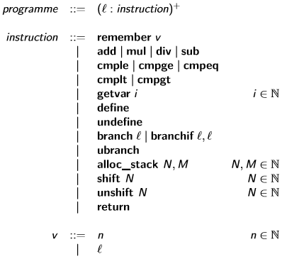  

Traduction :  
```
M=sv(e1)+K+sr(e1)
N=sv(e1)

C(f(a1,...,ak))=
    C(a1)
    ...
    C(ak)
    alloc_stack M,N
    remember l
    shift K
    branch lf
l:  ...

C(def f(x1,...,xn)=e) =
lf: C(e)
    unshift 1
    return
```
