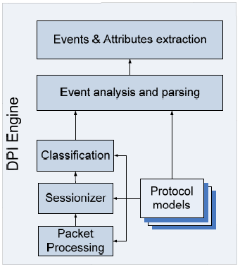
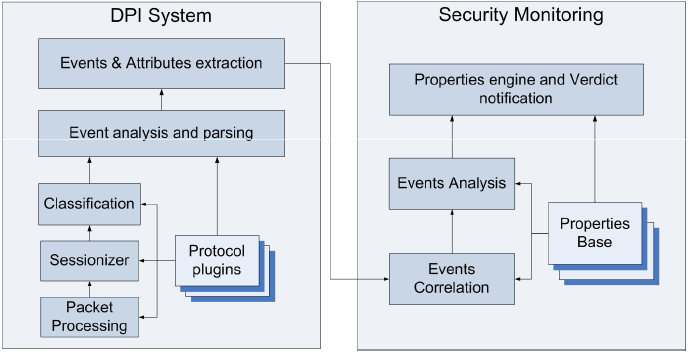

# Ingénierie des protocoles - cours 2 

Pour pouvoir déployer un nouveau protocole réseau : 
- définir les besoins (cahier des charges)
- conception. 
- formalisation (avec par exemple SDL). 
- vérification (des propriétés fonctionnelles) pour s'assurer que ce qu'on a 
conçu est bien adapté. 
- implémentation
- tests
- déploiement 
- maintenance (analyse de trafic réseau / Network monitoring)

## Network monitoring 

Analyse des mesures pour diagnostiquer et réagir.  
Permet de détecter les erreurs, les incidences de performance, de sécurité...  

C'est la procédure d'inspection du trafic. On va installer des sondes sur les 
points stratégiques (les noeuds qui nous intéressent). Ces sondes récoltent 
des informations qui sont classifiées. Celles-ci peuvent donner des indicateurs 
intéressant selon les besoins. 

Les composants sont : 

- l'application de surveillance (interface pour surveillance temps-réel + 
  stockage des données pour analyse ultérieure)
- unité d'analyse des performances (rassemble et établit des correlation entre 
  les mesures + calcule les indicateurs type QoS)
- unité de mesure (collecte les informations requises pour l'analyse)
- points d'observation (où les mesures seront faites. Plus ils sont nombreux, 
  plus les données sont précises). 

Ces mesures sont complexes à cause de la taille, la complexité et la diversité 
des réseaux et protocoles. De plus, la mesure n'est pas un objectif. 
Il faut exploiter ces mesures pour un objectif (qu'il faut donc définir : 
performance, sécurité...). 

### Déterminer ce qu'on veut mesure

Avant les mesures, il faut savoir quoi mesurer. Cela dépend de l'objectif. Il y 
a beaucoup de métriques de performance réseau utilisés couramment.  
Exemple : Les métriques de performances peuvent être classifiées en métriques 
réseau (latence, perte...), en métriques d'application (temps de réponse, 
disponibilité...) ou en métrique de qualité d'utilisation (QoE).  

### Déterminer comment on mesure

Une manière active, et une manière passive.  
  
La mesure active envoie du trafic sur le réseau, en générant des paquets de 
tests périodiquement ou à la demande.  
Il y a plusieurs outils populaires : RTT (*Ping* et *traceroute*), analyse 
des chemins.  
Problèmes : impose un trafic supplémentaire et peut altèrer le comportement du 
réseau.  
  
La mesure passive observe le trafic réseau aux points de mesure. On capture 
des paquets (avec *wireshark*) pour les analyser.  
Utile pour analyser l'utilisation, les intrusion...  
Problèmes : beaucoup de données, problèmes de confidentialité ou de 
performances. 

### Déterminer où il faut mesurer 

On peut ne mesure qu'un point  cela fournit une vue partielle du réseau. 
Il y a la mesure bout-à-bout.  
Il y a aussi les mesures multi-points, qui fournissent une vue de la 
performance sur les différents segments du réseau.  

### Limite des mesures 

Utilisé depuis des années, la surveillance est utilisée principalement, car 
ces informations sont très intéressantes. Toutefois on analyse seulement les 
headers, ce n'est pas suffisant.  
On pourrait vouloir savoir : Qui utilise skype ? Quelles sont les applications 
les plus populaires du réseau ? QoE pour le streaming ?  
Un bon candidate pour fournir des mesures précises est l'inspection des 
paquets en profondeur (*Deep Packet Inspection*). 

## Deep Packet Inspection 

On creuse dans les paquets pour inspecter le contenu encapsulé (couches 5-7). 
Le contenu peut être séparé entre plusieurs paquets.  

DPI donne plus de visibilité sur le réseau (comprendre comment la bande 
passante est utilisée).  
On peut contrôler l'application et le trafic (bloquer les spams, établir des 
priorités...).  
On peut gérer le réseau (facturation avancée).  
C'est aussi utile pour la sécurité (comprendre les attaques réseau). 

## A l'intérieur du DPI 

L'architecture générale :  

On groupe les paquets appartenant à la même sessions.  
La classification d'application est le coeur de DPI, elle détecte le type ou 
la famille d'application (Torrent, IM, ...).  
DPI fait le décodage du protocole et extrait les données : il parse la 
structure du paquet, récupère les attributs du protocole et de la session. Les 
évènements et attributs peuvent impliquer différents paquets (ex: pièce jointe 
d'un mail).  

## Classification des applications : le gros défi 

Il y a énormément d'application et protocoles, et pour un même protocole, il 
peut y avoir plusieurs implémentations et plusieurs clients. Les architectures 
évoluent.  
Il y a des mises à jour fréquentes (d'intervalles variées, elles vont affecter 
le format du protocole). 
Il faut encrypter. 
Il faut différentier un bon usage (streaming P2P) d'un mauvais usage (partage 
pirate).  
On a besoin de reconnaitre les subtilités de l'application pour les actions 
correctes. 

Les techniques les plus utilisées : 

- se baser sur les ports
- se baser sur un pattern matching (le paquet commence par tel ensemble de 
bits...)
- classification statistique 

L'objectif est d'être à la fois complet (le max d'applications possible), et 
précis. 

### Numéro de port 

Plusieurs applications utilisent des ports standards (ex : POP3 sur le port 110 
ou 995 avec SSL). Toutefois des applications utilisent des ports normalement 
utilisés par d'autres protocoles. De plus, il y a des protocoles nouveaux et 
inconnus. De toutes façons certaines application choisissent un port au hasard. 
La précision final est de 30 à 70 %. 

### Analyse par pattern matching 

Plusieurs application ont des ID purement textuelles, définies dans les 
documents de spécification de l'application / du protocole (ex: HTTP commence 
par "Method URI HTTP/1.1").  
Il est facile à trouver si dans un endroit spécifique au sein d'un paquet.  
L'unicité n'est pas garantie (risque de faux positifs). Le patron peut 
impliquer différents paquets (état de la connection + signature). 

### Analyse statistique 

Plusieurs protocoles ont des *signatures* statistiques et comportementales qui 
ne sont pas liées au contenu : taille du paquet, délai, échange spécifique...  
La détéction requiert un certain nombre de paquets.  
Très efficace quand les application utilisent *l'encryption* ou 
*l'obfuscation*, ou simplement quand l'accès au contenu n'est pas possible. On 
classifie "dans le noir". 

### Classification des paquets : une opération couteuse 

Il faut beaucoup de mémoire, pour augmenter le nombre de protocoles et 
d'applications supportées. Il faut aussi un bon hardware.  

### Extraction d'informations 

La classification est la 1ere étape vers l'extraction de données précises sur 
le trafic. Les attributs du trafic sont : 

- le champs de protocole (taille de la pièce jointe, type d'encodage, ...) 
- paramètres de flux : délai, taux de paquets perdus, reordonnancement...
- la classe de l'application peut être considérée comme un attribut 

On peut voir DPI comme un moteur d'extraction de données du réseau, alors vu 
comme une BDD (*SELECT user_id, perceived_quality WHERE application=Video 
AND protocol=RTP*). 

## DPI et la surveillance de sécurité 

Les injections SQL sont dans le top 10 des vulnérabilités les plus connues. Ce 
top 10 est responsable de 60% des bugs logiciels. Pourant souvent, on peut les 
éviter.  
  
On cherche à détecter l'occurence d'**évènements** sur le réseau (comme 
l'arrivée de paquets, les requêtes POST...). Les entrées sont fournies par 
*DPI*. On inspecte la succession d'évènements pour détecter des 
**propriétés** (Exemple : *après A, B doit arriver en moins de 10 secondes*).  
L'idée est de surveiller le réseau à la recherche de l'occurence de ces 
propriétés.  
Le soucis, c'est que le nombre d'évènements pouvant surgir est énorme. C'est 
pourquoi on utilise *DPI*, pour l'extraction d'évènements : on les regroupe 
par application.   
  
Toutefois, l'expressivité des propriétés doit être forte (contraintes de temps 
et de logique). Une propriété est composée de 2 parties : un contexte, et une 
condition à vérifier. Chacune est composée d'évènement *simples* (IP égal à X) 
ou *complexes* (liées par des opérateurs logiques ou chronologiques comme *AND, 
OR, NOT, AFTER, BEFORE*). 

