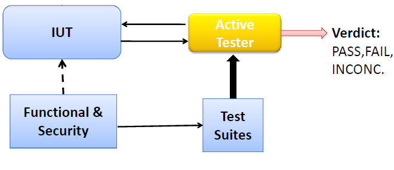
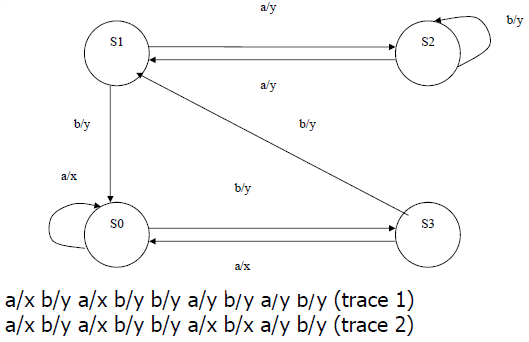
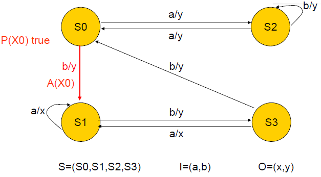
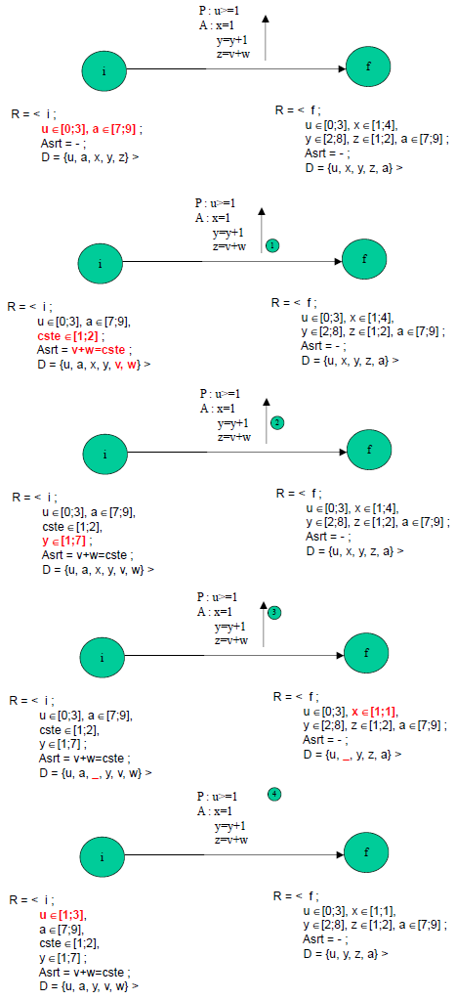

# Ingénierie des protocoles - Cours 4 :  Tests passifs 

## Test actif et test passif 

### Test Actif

 

Principe : envoyer des messages via l'iplémentation, attendre une réponse, 
et comparer cette réponse avec celle qui est attendue. Il y a deux phases : 
**génération** des tests, puis **application**.  
On peut se concentrer sur une zone particulière de la spécification. Par 
contre, la génération automatique est difficile. En plus, on peut faire 
crasher l'IUT.  
  
En détails :  
A partir de la spécification, on va écrire l'implémentation qu'on va tester. 
On se base sur le même modèle formel pour générer une suite de tests qu'on va 
appliquer à l'IUT pour détecter (et corriger) d'éventuels bugs. Cette suite 
doit être la plus complète possible, mais en nombre raisonnable pour ne pas 
que les tests soient trop longs. On fait des études de risque, mais il y a 
aussi des classifications.  
Le *testeur* est stimulé par l'IUT sur les PO (points d'observation).  
  
Le test actif analyse les sorties du programme et les compare aux sorties 
prévues par la spécification : **test de conformité**.  
  
Sinon, on peut détecter 3 types d'erreurs : erreurs de **sortie**, erreurs de 
**transfert** (mauvaise transition), ou **mixte**. 

### Test passif 

 

On observe les séquences d'entrées/sorties (**traces**) qu'on analyse par 
rapport à la spécification, afin de donner un verdict.  
Il n'y a plus d'interférences avec le système (même si le fait de *sniffer* 
peut avoir un impact léger sur les performances). Il n'y a plus besoin de 
générer des tests. Par contre, les algorithmes sont peu efficaces. 

## Vérification avant

On a une trace et une spécification. On cherche à voir si la trace peut être 
générée par la spécification.  
Il y a deux techniques : en **avant** (commence par la trace la plus ancienne) 
ou en **arrière** (commence par la trace la plus récente).   
  
On fait un **graphe d'accessibilité**, et si avec une recherche en profondeur 
on trouve un chemin portant la trace, l'implémentation est bonne. *trace 1* 
est correcte. 

### EFSM 

Une **machine à états finis étendue (EFSM)** possède des *évènements 
d'entrée/sortie* (avec ou sans paramtres), un *prédicat* à satisfaire, et des 
*actions* à effectuer.  
Elles sont de la forme E = (S, S<sub>0</sub>, S<sub>f</sub>, I, O, x, T) avec 

- S : ensemble fini non vide d'états
- S<sub>0</sub> : état initial
- S<sub>f</sub> : ensemble fini d'états finaux
- I : ensemble fini de symboles d'entrées (*paramètres*)
- O : ensemble fini de symboles de sortie (*paramètres*)
- x : ensemble fini de variables
- T : ensemble fini de transitions de la forme (s<sub>t</sub>, f<sub>t</sub>, 
i<sub>t</sub>, o<sub>t</sub>, P<sub>t</sub>, A<sub>t</sub>) où 
  + s<sub>t</sub> : état de départ
  + f<sub>t</sub> : état d'arrivée
  + i<sub>t</sub> : évènement d'entrée
  + o<sub>t</sub> : évènement de sortie
  + P<sub>t</sub> : prédicat
  + A<sub>t</sub> : ensemble d'actions



### Test par détermination de la valeur 

On détermine la valeur d'une variable par rapport à la trace detéctée. 
L'algorithme a deux phases : 

- "homing" : on explore la trace jusqu'à ce qu'un seul état reste, pour découvrir 
la valeur des variables.
- détection : on trouve les erreurs en explorant la trace soit jusqu'à la fin, soit 
quand on voit une erreur. 

Le soucis c'est que quelques transitions donnent plusieurs valeurs à une 
variable. 
Il y a aussi un problème avec les machines non-déterministe, on va alors 
travailler avec des intervalles. 

### Test par détermination de l'intervalle 

Les valeurs peuvent se loger dans un intervalle, ce qui peut résoudre le 
problème de la perte d'information : il peut y avoir plusieurs valeurs possibles 
pour chaque variable.  
Une **assertion** est un prédicat en FND sur un ensemble de variables qui doit 
être **vrai** dans l'état courant. Son rôle est d'imposer des contraintes sur les 
variables.  
On définit le **CCS (Candidate Configuration Set)** comme le triplet (s, R, Asrt) 
avec : 

- s : l'état
- R : l'ensemble des contraintes sur les variables (intervalles)
- Asrt : assertions sur les variables 

Une transition *t* est faite si au moins un CCS est compatible avec les prédicats 
sur *t*. 

```Exemple de CCS : (1, {R(x) = [1;5]}, x < 2 || x > 2)```

On fait ensuite des tests de **consistance** et de **raffinement**. Si un 
intervalle devient vide, c'est que la configuration est fausse.  

- normalisation : on remplace les variables par leurs valeurs constantes, et on 
rajoute des constantes. Toutes les variables (avec coefficient) sont d'un côté, 
les constantes de l'autre
- raffinement : &Sigma;<sub>i</sub> a<sub>i</sub>R(x<sub>i</sub>)) 
= R(~Z) avec **~** un opérateur de comparaison. Le raffinement 
R'(x<sub>j</sub>) de x<sub>j</sub> est : 
- consistance : on traite séparément chaque terme disjonctif, leurs prédications 
sont contrôlés et les intervalles raffinées. Les prédicats inutiles et les clauses 
fausses sont éliminée. Quand on ne peut plus raffiner, c'est fini.  

On dispose de règles pour procéder sur les actions : 

- si w&larr;constante c : on pose R(w) = c, et on élimine les prédicats 
contenant *w*. 
- si w&larr;f(X) avec w&isin;X : on calcule le nouveau R(w) et on remplace *w* 
par f<sup>-1</sup>(w) dans les assertions. 
- si w&larr;f(X) avec w&notin;X : on calcule le nouveau R(w), on supprimer les 
prédicats contenant *w*, et on ajoute à l'assertion un prédicat *w = f(X)*

## Vérification arrière 

En vérifiant la trace depuis la fin vers le début, on est sûrs de commencer avec 
une information correcte. On peut construire artificiellement une trace plus 
longue. Pour qu'une trace passée soit validée, on doit valider des variables 
spéciales : les **déterminants**. Par définition, une variable est un 
**déterminant** pour une trace si cette variable doit forcément être validée 
avant de pouvoir valider la trace. 

### Backtracking de transition 



### Backtracking de trace 

Version en arrière de l'algorithme de détermination des intervalles : on fait le 
backtracking de la transition pour chaque couple d'entrée/sortie.

### Backtracking du passé d'une trace 

#### Intersection 

*c = c<sub>1</sub>&cap;c<sub>2</sub>.*  
Pour toute variable *v*, on calcule R<sub>c</sub>(v) = R<sub>1</sub>(v) 
&cap; R<sub>2</sub>(v).  
Asrt<sub>c</sub> = Asrt<sub>1</sub>&and;Asrt<sub>2</sub>.  
L'intersection est **vide** si inconsistante.

#### Privation

*(c<sub>a</sub>, c<sub>b</sub>) = c<sub>1</sub> | c<sub>2</sub>).*  
Si *v* est une variable, R<sub>a</sub>(v) = R<sub>1</sub>(v) &cap; 
R<sub>2</sub>(v).  
Asrt<sub>a</sub> = Asrt<sub>1</sub>&and;&not;Asrt<sub>2</sub>.  
R<sub>b</sub> = R<sub>1</sub>.  
Asrt<sub>b</sub> = Asrt<sub>1</sub>&and;
&or;<sub>i</sub>(v<sub>i</sub>&notin;R<sub>2</sub>(v<sub>i</sub>)).  
La privation est **vide** si inconsistante. 

#### Convergence 

Deux chemins P<sub>1</sub> et P<sub>2</sub> **convergent** si ils mènent 
à la même configuration *c*.  
On peut élaguer l'arbre d'exploration (ici c<sub>1</sub> a été rencontré avant 
c<sub>2</sub>) : 

- c<sub>1</sub>&cap;c<sub>2</sub> = &empty; &hArr; c<sub>1</sub> et 
c<sub>2</sub> sont indépendants
-  c<sub>1</sub>&cap;c<sub>2</sub> = c<sub>2</sub> 
&hArr; c<sub>2</sub> est inclus dans c<sub>1</sub> : on peut couper 
c<sub>2</sub>
- sinon c<sub>1</sub> est inclus dans c<sub>2</sub> : on remplace 
c<sub>2</sub> par c<sub>2</sub>\c<sub>1</sub>

#### Heuristique 

On donne des priorités aux transitions.  
Le **poids** d'une transition est plus gros si l'état de départ de la transition est 
l'état initial (*w1*), si il n'a jamais été visité (*w2*) ou si la transition décide une 
variable (*w3*).  
La priorité est donnée par le plus gros poids : *W = w1 + w2 + n.w3* pour *n* 
variables décidées. 

#### Backtracking 

Il faut que l'algorithme termine. Si une configuration est visitée indéfiniment, on 
élague. Si les décrémentation/incrémentation sont infinies, on limite le domaine 
de définition des variables.  
Si chaque chemin est fini, le nombre de configurations est fini et les domaines 
sont finis.  
Si le nombre de chemins est fini, chaque chemin est fini.  
L'algorithme devient plus efficace quand on travaille sur un petit nombre de 
variables aux domaines restreints, et si les états ont peut de transitions 
entrantes. 

## Invariants 

Le **test par invariants** se déroule en 2 étapes.  
D'abord, on extrait les invariants de la spécification.  
Ensuite, on applique ces invariants aux traces de l'implémentation.  
  
Un **invariant** est composé de 2 parties : le *préambule* (séquence d'E/S) et 
le *test* (une entrée ou une sortie).  
Il y a 3 sortes d'invariants : 

- d'entrée : immédiatement avant le préambule, il y a toujours l'entrée *test*
- de sortie : immédiatement après le préambule, il y a toujours la sortie *test* 
- de succession : pour des propriétés complexes

## Erreurs 

La technique des invariants permet de trouver les erreurs de transfert.  
La technique des intervalles détecte les erreurs de sortie.  
La technique des valeurs ne détecte aucune de ces deux erreurs.  