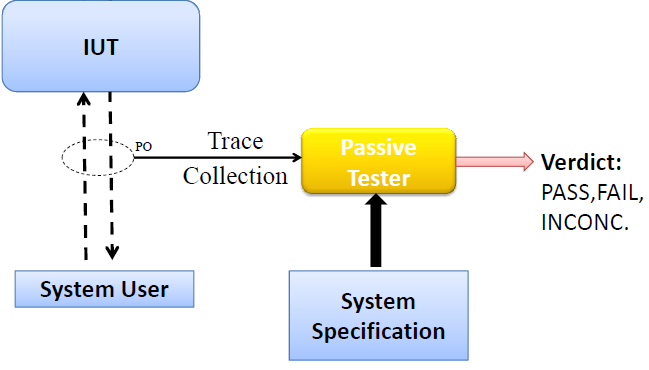

# Ingénierie des protocoles - Cours 4 :  Tests passifs 

## Test actif et test passif 

### Test Actif

 

Principe : envoyer des messages via l'iplémentation, attendre une réponse, 
et comparer cette réponse avec celle qui est attendue. Il y a deux phases : 
**génération** des tests, puis **application**.  
On peut se concentrer sur une zone particulière de la spécification. Par 
contre, la génération automatique est difficile. En plus, on peut faire 
crasher l'IUT.  
  
En détails :  
A partir de la spécification, on va écrire l'implémentation qu'on va tester. 
On se base sur le même modèle formel pour générer une suite de tests qu'on va 
appliquer à l'IUT pour détecter (et corriger) d'éventuels bugs. Cette suite 
doit être la plus complète possible, mais en nombre raisonnable pour ne pas 
que les tests soient trop longs. On fait des études de risque, mais il y a 
aussi des classifications.  
Le *testeur* est stimulé par l'IUT sur les PO (points d'observation).  
  
Le test actif analyse les sorties du programme et les compare aux sorties 
prévues par la spécification : **test de conformité**.  
  
Sinon, on peut détecter 3 types d'erreurs : erreurs de **sortie**, erreurs de 
**transfert** (mauvaise transition), ou **mixte**. 

### Test passif 

 

On observe les séquences d'entrées/sorties (**traces**) qu'on analyse par 
rapport à la spécification, afin de donner un verdict.  
Il n'y a plus d'interférences avec le système (même si le fait de *sniffer* 
peut avoir un impact léger sur les performances). Il n'y a plus besoin de 
générer des tests. Par contre, les algorithmes sont peu efficaces. 

## Vérification en avant / en arrière

On a une trace et une spécification. On cherche à voir si la trace peut être 
générée par la spécification.  
Il y a deux techniques : en **avant** (commence par la trace la plus ancienne) 
ou en **arrière** (commence par la trace la plus récente).   
  
On fait un **graphe d'accessibilité**, et si avec une recherche en profondeur 
on trouve un chemin portant la trace, l'implémentation est bonne. *trace 1* 
est correcte. 

### EFSM 

Une **machine à états finis étendue (EFSM)** possède des *évènements 
d'entrée/sortie* (avec ou sans paramtres), un *prédicat* à satisfaire, et des 
*actions* à effectuer. 

### Test par détermination de la valeur 

On détermine la valeur d'une variable par rapport à la trace detéctée. 
L'algorithme a deux phases [p21] : 

- "homing" : on explore la trace pour découvrir la valeur des variables.
- détection : 

Le soucis c'est que quelques transitions donnent plusieurs valeurs à une 
variable. 
Il y a aussi un problème avec les machines non-déterministe, on va alors 
travailler avec des intervalles. 
