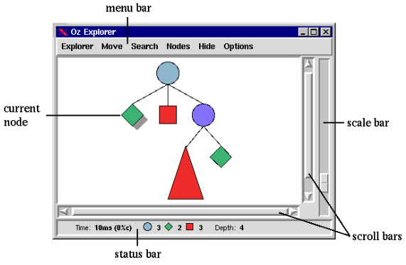

# Programmation Logique Avancée - Cours 4 : Programmation Logique en Oz

## Programmation logique

La programmation logique se base sur un paradigme de **recherche**, exprimant
plusieurs possibilités de continuation du calcul.  
Il y a un donc un *non-déterminisme*, pouvant être :

* non-déterminisme *"don't care"* (indéterminisme) : toutes les alternatives
sont bonnes et mênent à un résultat équivalent, la machine fait son choix
* non-déterminisme *"don't know"* : on ne sait pas quel est le bon choix, la
machine doit explorer tous les choix et faire un arbre de recherche - c'est le
principe utilisé en programmation logique

On peut faire un **arbre de recherche** avec ```choice .. end``` qui indique
un choix entre plusieurs possibilités de continuer. Son exécution crée un
*choice point*, sur lequel on revient si le choix a échoué. Les *choice points*
sont les noeuds de l'arbre.  
Une branche peut échouer si elle rencontre l'instruction ```fail```. Le calcul
reprend avec l'alternative la plus proche (recherche en profondeur d'abord).
Un échec de ```tell``` provoque également un ```fail```.  

Pour obtenir les solutions :

* ```{SearchOne P}``` donne la valeur de X pour la 1ère solution de l'arbre,
si *P* est une procédure à un argument *X*
* ```{SearchAll P}``` donne toutes les solutions dans une liste de valeurs.

Souvent, on écrit *P* comme une fonction à zéro arguements.

## L'explorateur et l'inspecteur

L'**explorateur** permet d'étudier l'arbre de recherche.  
  
Pour expliciter ce qu'affiche l'explorateur via le code :

* ```{ExploreOne F}``` affiche l'arbre pour *{F X}* (avec *F* une fonction à 1
argument) jusqu'à la 1ère solution
* ```{ExploreAll F}``` affiche l'arbre complet pour *{F X}*
