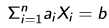
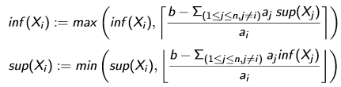

# Programmation Logique Avancée - Cours 6 : Propagateurs

## Propagateurs de bornes

On parle de l'**infimum** et du **suprémum** du domaine d'une variable
*(inf(x),sup(x))*.  
Un **propagateur de bornes** va faire croître l'infimum et décroître le
suprémum d'un domaine. Il va donner un domaine qui est un intervalle.  
Pour une équation linéaire   (où *X<sub>i</sub>*
sont des variables et *a<sub>i</sub>*, *b* des constantes entières), le
propagateur va faire :  


## Propriétés des propagateurs

On définit un ordre partiel sur *D*, l'ensemble de tous les domaines.  
D<sub>1</sub> ⊑ D<sub>2</sub> ⇔
∀x ∈ F : D<sub>1</sub>(x) ⊆ D<sub>2</sub>(x)  
Un propagateur est une fonction **monotone** et **décroissante** (selon
  l'ordre *⊑*).  
Un propagateur n'est pas nécessairement *complet* ou
*idempotent* ( *p(p(D))=p(D)* ).  

Un propagateur *p* est **correct** par rapport à la contrainte *c* et
l'ensemble de variables *F* si, pour tout *d∈D* :  
Si *α⊨c* et *∀x∈F:α(x)∈d(x)* alors *∀x∈F:α(x)∈p(d)(x)*  
Autrement dit : *p* ne perd pas de solutions à la contrainte *c*.

Un ensemble *P* de propagateurs est complet par rapport à une contrainte si
on élimine toutes les non-solutions seulement par propagation. Formellement :

- si on atteint un point fixe *p(d)=d* pour tout *p∈P* et tout *d∈D*
- et si *α* est une affectation admise par *D* : *∀x∈F:α(x)∈p(d)(x)*
- alors *α⊨c*  

Ce n'est pas toujours le cas. Exemple de non-complétude :
```
declare X Y Z [X Y Z]:::1#10 {Browse [X Y Z]}
X*Y =: Z
Z = 10
X >: 1
Y >: 1
```

## Algorithme de propagation

L'algorithme naïf de propagation de contraintes :

```
while ∃ propagateur p with p(D) ≠ D do
  D := p(D)
end
```

* l'algorithme termine si *F* est fini : tous les domaines sont finis et tous
les propagateurs sont décroissants
* l'algorithme est non-déterministe
* l'algorithme est naïf car on cherche à chaque itération un propagateur dans
l'ensemble des propagateurs

Quelque soit la stratégie utilisée, à la fin on obtient un domaine *D* qui est
un point fixe **D** (*p(d)=d* pour tous propagateurs) plus petit que le domaine
initial (*D⊑D<sub>0</sub>*). On montre ceci par induction, utilisant la
monotonie et le point fixe.  

## Exemple : colorier une carte

On a une liste d'association des pays à la liste de leurs voisins :  
```
Europe = [
autriche   # [italie suisse allemagne]
belgique   # [france holland allemagne luxembourg]
france     # [espagne luxembourg italie]
allemagne  # [autriche france luxembourg hollande]
italie     # nil
luxembourg # nil
hollande   # nil
portugal   # nil
espagne    # [portugal]
suisse     # [italie france allemagne autriche]
]

declare
fun {MapColoring Data}
  Countries = {Map Data fun {$ C#_} C end} in
  proc {$ Color}
    NbColors = 4
  in
    Color = {FD.record color Countries 1#NbColors}
    {ForAll Data
    proc {$ A#Bs}
      {ForAll Bs proc {$ B} Color.A \=: Color.B end}
    end}
    {FD.distribute ff Color}
  end
end

{Brose {SearchOne {MapColoring Europe}}}
```
