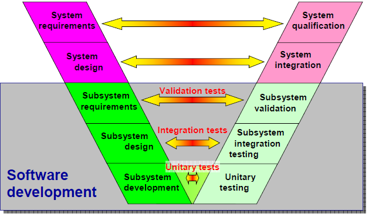

# Programmation synchrone - Cours 1

## Le contexte

Programmation d'un logiciel embarqué, critique, fonctionnant en temps réel.

* Embarqué : qui fait partie d'un système matériel / logiciel (avion,
lave-vaisselle).
* Temps-réel : il y a plusieurs classifications.
- le transformationnel (calculatoire) lit l'entrée 1 fois, fait des calculs et
renvoie le résultat.
- l'interactif réagit aux demandes de l'environnement (user), à sa vitesse. Il
fait plusieurs traitements.
- le réactif temps-réel, qui est intéractif mais réagit à la vitesse de
l'environnement ou à la vitesse requise. Il peut etre mou ou dur (on ne doit
pas rater les échéances). C'est la qualité de service (exemple : décompression
vidéo).
* Critique : le système ne doit pas tomber en panne sous peine d'impacts
sévères. De nombreux standards décrivent des niveaux de criticité.

## Comment développer un tel logiciel ?



Particularité du modèle en V pour les logiciels critiques : la validation
est très longue et couteuse, environ 50 % du cout.

Model-based design : Y à la place de V.


On fera le modèle en Y. Il nous faut un langage de programmation ergonomique,
avec une sémantique formelle bien définie (pour assurer la cohérence, la
complétude, la possibilité de preuves).  
On veut que nos programmes soient déterministes. Il faut aussi pouvoir
assurer la sécurité (protection contre l'environnement, l'intrus...),
la fiabilité (peu de pannes en fonctionnement normal) et
la sureté (le logiciel ne fait pas de dégats à l'environnement).  

## L'approche synchrone

Née dans les années 80 en France, avec Lustre, Esterel et Signal. En 93,
Lustre donne la base de SCADE (Safety Critical Application Development
Environment).  
Le principe : il y a une horloge globale, entre chaque tick, il y a lecture
des entrées, calcul, et écriture des sorties.  
Pour que ça marche il faut respecter l'hypothèse synchrone :
**lire-calculer-écrire prend le temps 0**
ou **on finit lire-calculer-écrire avant le tick suivant**.  
``|tick|L|C|E|tick|L|C|E|tick|...````

Le langage SCADE a 2 styles : la base par flot de données, ou par automates.
Ces 2 styles se combinent.
A chaque tick on a une valeur pour une variable.

Un opérateur prend quelques flots, calcule, et renvoie quelques flots.  
On a plusieurs opérateurs : +, /, %, <>, =, # (exclusion mutuelle) ...  
On peut faire nos propres opérateurs en combinant les opérateurs de base, tant
qu'on respecte les types.  

3 opérateurs temporels importants (cf schemas) :

- **PRE** (précédent), qui donne Y_n = X_(n-1), la valeur au *tick prédécent*
- &rarr; (initialisation,, qui donne Y_0 = i_0 (initial) et Y_n = X_n pour n > 0
- on fait souvent des combinaisons de PRE et &rarr;, qu'on appelle FBY (Followed
By).  
FBY(x,n,init) = init &rarr; (PRE(PRE...x)) *[n fois]*
- **&#10710;** (times) : la sortie est vraie si depuis le début, l'entrée a été
vraie un nombre de fois au moins égal au nombre spécifié

Les *boucles* sont autorisées, car on a besoin d'un peu de mémoire (1 retard +
1 boucle). On branche la sortie sur l'entrée.  

Un diagramme SCADE est un système d'équations sur les flots :
- on donne des noms à tous les flots.
- on écrit une équation pour chaque brique constituante.
```
Exemple somme :
u = pre(s)  
v = x + u
s = x -> v
```
Si le diagramme est bien (causal), alors pour chaque entrée on résout facilement
les équations, et la sortie est bien définie.  

**Règle de causalité : chaque boucle doit contenir *PRE* ou *&rarr;*.**  

**Théorème** : chaque diagramme SCADE bien typé, où toutes les variables sont
initialisées et où toutes les boucles sont causales, est correct, son
comportement est bien défini.  

**Principe de modularité** : on peut utiliser des opérateurs personnalisés dans
d'autres opérateurs.
