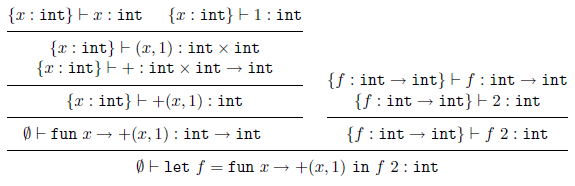

# Typage - Cours 1 : Typage d'un langage fonctionnel, Mini-ML

## Syntaxe de Mini-ML

Le langage **Mini-ML** est fait d'expressions (notées *a, a<sub>1</sub>, a',
...*) suivant la syntaxe :

```
expressions:  a ::= x                (identificateur)
                  | c                (constante entière, booléenne, littérale)
                  | op               (opération arithmétique, projection...)
                  | fun x -> a       (abstraction de fonction)
                  | a1 a2            (application de fonction)
                  | (a1, a2)         (construction d'une paire)
                  | let x=a1 in a2   (liaison locale)
```
On peut faire des expressions conditionnelles : c'est un
opérateur ```ifthenelse``` appliqué à *(a1,(a2,a3))*.  
Il est aussi possible de faire des fonctions récursives avec un opérateur
de point fixe ```fix``` tel que *fix(fun f -> a) = f (vérifiant f=a)*.  
Exemple :  
```
(* factionelle n *)
fix(fun fact -> fun n -> if n=0 then 1 else n*fact(n-1))
(* power f n *)
fix(fun power -> fun f -> fun n ->
        if n=0 then (fun x -> x)
        else (fun x -> power(f)(n-1)(f(x))))
```

## Evaluation : sémantique opérationnelle à grands pas

La sémantique opérationnelle va définir comment se déroule l'exécution d'un
programme. Elle prend la forme de relations entre expressions *a* et
valeurs *v* : **a -> v**.  

Les valeurs suivent cette grammaire :
```
valeurs:  v ::= fun x -> a   (valeurs fonctionnelles)
              | c            (valeurs constantes)
              | op           (primitives non appliquées)
              | (v1, v2)     (paires de deux valeurs)
```

Pour définir la relation d'évaluation, on utilise des **règles d'inférence** :  
  

La sémantique de Mini-ML est **déterministe**, on peut le prouver par
récurrence sur les dérivations.  

## Typage de Mini-ML

Le typage statique vise à détecter et rejeter à la compilation des programmes
absurdes. On doit attribuer un *type* à chaque sous-expression du programme,
et vérifier la cohérence entre ces types.  
Le système doit être décidable : on ne veut pas devoir exécuter le programme
lors de la compilation.  

Syntaxe des types :  
```
Types: τ ::= Τ           (type de base : int, bool, ...)
           | σ           (variable de type)
           | τ1 -> τ2    (fonction de τ1 dans τ2)
           | τ1 ⨯ τ2     (type des paires de τ1 et τ2)
```

Les règles de typage (ici c'est un typage **monomorphe**) portent sur des
triplets *(E, a, τ)* avec *a* une expression, *τ* un type, et *E* un
**environnement de typage** qui associe des types *E(x)* aux identificateurs
*x* libres dans *a*.  
On note la relation de typage ```E ⊢ a:τ```. Elle est définie comme suit :  
  
La fonction *TC* associe un type à chaque constructeur et opérateur
(*TC(0)=int*, *TC(+)=int x int -> int*).  
Exemple :  
  

### Schémas de types

Avec le typage monomorphe, chaque identificateur ne peut avoir qu'un seul type.
Les **schémas de type** cassent cette limitation en représentatant tous les
types pouvant être donnés à une expression polymorphe.  
Un schéma de types est une expression de types avec zéro ou plusieurs
variables de types universellement quantifiées : ```σ ::= ∀α1, .., αn . τ```  

Si l'ensemble est vide, on note simplement *τ* au lieu de *∀τ*.  
Les variables liées par *∀* peuvent être renommées (*alpha-conversion*), donc
les schémas de types sont considérés égaux modulo
l'aplha-conversion : ```∀α.τ = ∀β.τ[α←β]```si β n'est pas libre dans τ ou si
β=α.  

L'ensemble des variables libres d'un type, d'un schéma ou d'un environnement
est défini comme suit :  
  

On peut voir un schéma de types comme l'ensemble des types obtenus en
instanciant ses variables quantifiées avec des types particuliers
(*spécialisation*). On introduit la relation **τ ≤ σ** :
```τ ≤ ∀α1, .., αn . τ' ``` *ssi*
il existe *τ1, .., τn* avec ```τ=τ'[α1←τ1, ..., αn←τn]```

## Typage polymorphe à la ML

On reprend les règles monomorphes déjà définies, avec quelques modifications :

* l'environnement de typage *E* associe des schémas de types aux
identificateurs
* *TC* associe des schémas de types aux constantes et opérateurs
* la règle de typage d'un identificateur effectue une étape d'instanciation
sur le schéma de type de cet identificateur
* la règle du *let* généralise le type de l'expression avant de typer le corps

  
L'opérateur ```Gen(τ1, E)``` (règle *let-gen*) est *τ1* où on a **généralisé**
toutes les variables non libres dans *E* :  
```Gen(τ1, E) = ∀α1, .., αn . τ1``` avec ```{α1, .., αn} = L(τ1)\L(E)```.  
Exemple :  
  

### Propriétés des règles de typage

Le typage est stable par substitution de variables de types : si on peut
dériver ```{f:α->α; x:α} ⊢ f x : α```, on peut aussi dériver cette expression
où *α* a été substitutée par un type. On suppose toutefois que les schémas
*TC(c)* et *TC(op)* sont clos.  

Les typages ne changent pas si dans l'envrionnement de typage, on ajoute ou
supprime des "hypothèses inutiles" (portant sur des variables non libres) :
```{x:αx; y:int} ⊢ a:τ``` est dérivable *ssi*
```{x:αx; z:bool} ⊢ a:τ``` est dérivable.  

Tous les typages dérivables sous une hypothèse peuvent être dérivés sous des
hypothèses plus fortes. On introduit la **généralité ≥** : ```σ' ≥ σ```
signifie que *σ'* est plus général que *σ*, toute instance de *σ* est aussi
une instance de *σ'*.
