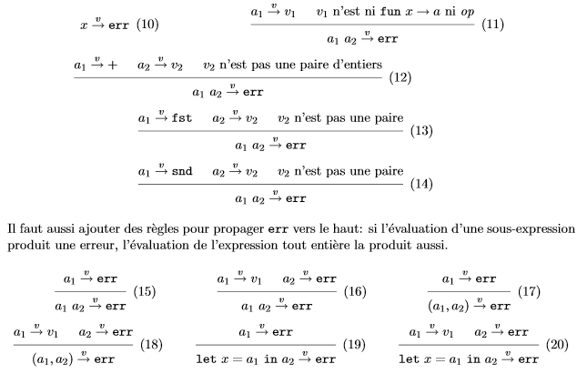
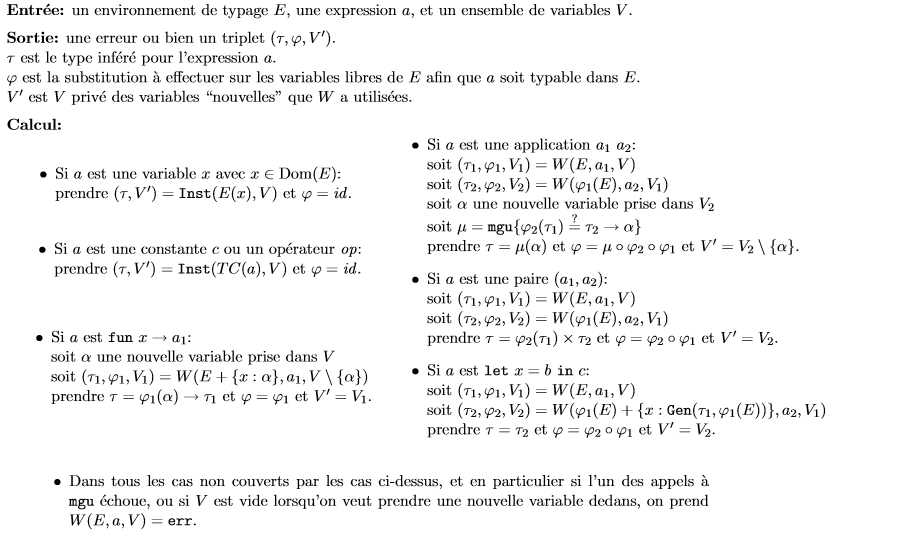

# Typage - Cours 2 : Inférence de types

## Introduction

La quantité de travail fournie par le typeur dépend de la quantité de
déclarations présentes dans le langage source.  

Il y a **vérification pure** si toutes les sous-expressions du programmes et
tous les identificateurs sont annotés par leur type.
```
fun (x:int) ->
(let (y:int) = (+:int x int -> int)((x:int),(1:int):int x int) in (y:int) : int)
```
Le typeur est simple, vu que le programme contient autant d'information de
typage que la dérivation en a besoin. Toutefois, aucun langage ne suit cette
approche.  

On peut avoir **la déclaration des types des identificateurs** et le
**propagation des types**. Le programmeur déclare les types des paramètres des
fonctions, et les variables locales. Le typeur va inférer en propageant des
feuilles de l'expression vers la racine.
```
fun (x:int) -> let (y: int) = +(x,1) in y
```
Le typeur, sachant que *x* est de type *int* peut vérifier que ```x+1``` est
bien typée et qu'elle a le tupe *int*. Il infère pour l'expression le type
*int -> int*. C'est l'approche utilisée dans les langages impératifs.  

On peut aussi simplement **déclarer les types des paramètres** qui vont se
**propager**. Les variables locales ne sont plus annotées par leur type.  
```
fun (x:int) -> let y = +(x,1) in y
```
Le typeur trouve que *+(x,1)* est de type *int* donc que *y* est un *int* dans
le reste de la fonction.  

Enfin, il y a un **inférence complète de types** si le programme ne contient
aucune déclaration de type dans les fonctions et variables locales. Le typeur
déduit en fonction de l'utilisation qui en est faite dans le reste du
programme.
```
fun x -> let y = +(x,1) in y
```

## Inférence de types pour Mini-ML monomorphe

L'inférence de type se déroule en deux étapes :

* A partir de la source, on construit un système d'équations entre types qui
caractérise tous les typages possibles du programme
* On résout ensuite ce système. Si il n'y a pas de solution, le programme est
mal typé. Sinon, on détermine une solution principale au système, qui va donner
le type principal du programme.

### Construction du système d'équation

On se donne un programme *a<sub>0</sub>* où tous les identificateurs liés
par ```fun``` ou ```let``` ont des noms différents. A chaque identifiant *x* est
associée une variable de type *α<sub>x</sub>*.  
On va parcourir l'expression, et pour chaque sous-expression *a* on ajoute des
équations selon des règles :
  
Exemple :


Une **solution** de l'ensemble des équations *C(a)* est une substitution φ telle que,  
pour toute équation τ<sub>1</sub>τ<sub>2</sub> dans
*C(a)*, on a *φ(τ<sub>1</sub>) = φ(τ<sub>2</sub>)*.  
Autrement dit, une solution est un unificateur de l'ensemble d'équations
*C(a)*.

### Résolution des équations

L'ensemble *C(a)* est un problème d'unification du 1er ordre. Il existe un
algorithme **mgu** :

* si *mgu(C)* échoue, *C* n'a pas de solution
* si *mgu(C)* renvoie une substitution *φ* (un unificateur principal) qui est
solution de *C* (de plus, toute autre solution ψ peut s'écrire *ψ=θoφ*)

L'algorithme **mgu** est défini :  
  

### L'algorithme d'inférence

L'algorithme d'inférence de types *I(a)* est simple :

* Entrée : une expression close *a*
* Sortie : une erreur *err*, ou un type *τ*
* Calcul : on calcule *φ=mgu(C(a))*, si *mgu* échoue on renvoie *err*,
sinon φ(α(a))

Cet algorithme a plusieurs propriétés :

* Correction : si *I(a)* est un type *τ*, alors *∅⊢a:τ*
* Complétude : si *I(a)* vaut *err*, alors *a* n'est pas typable dans *∅*
* Principalité du type inféré : s'il existe un type *τ'* tel que *∅⊢a:τ'*,
alors *I(a)* n'est pas *err*. Au contraire, c'est un type *τ* et il existe
une substitution *θ* telle que *τ'=θ(τ)*

## Inférence de types pour Mini-ML polymorphe

Il faut étendre les règles des équations, en ajoutant des règles pour les
contraintes d'*instanciation* et de *généralisation*.

* Si *a* est une variable **x** : *C(a) = {α<sub>a</sub> ≤ α<sub>x</sub>}*
* Si *a* est **let x=b in c** :
*C(a) = {α<sub>x</sub>  Gen(α<sub>b</sub>,E);
  α<sub>a</sub>  α<sub>c</sub>}∪C(b)∪C(c)* où *E* est
  l'environnement {y: α<sub>y</sub>} pour tout *y* lié là où apparait le *let*

On a maintenant des schémas et non plus des types simples. On ne peut plus
résoudre les contraintes d'unification et de généralisation dans n'importe quel
ordre. Il faut un nouvel algorithme.

### L'algorithme W de Damas-Milner-Tofte

On définit d'abord la notion d'**instance triviale *Inst(σ,V)* **d'un schéma de
types *σ* par rapport à un ensemble *V* de "variables nouvelles".  
**Inst(∀α<sub>1</sub>,...,α<sub>n</sub>.τ, V)
= (τ[α<sub>i</sub>←β<sub>i</sub>], V\{β<sub>1</sub>..β<sub>n</sub>})**
avec *β<sub>i</sub>* des variables distinctes choisies dans *V*.

L'algorithme **W** :  
  
Exemple :  


### Expansion des let

En observant  
  
et en vertu du lemme de substitution (*E⊢a<sub>2</sub>[x←a<sub>1</sub>]:τ*),
on peut en fait substituer *x* par *a<sub>1</sub>* partout dans
*a<sub>2</sub>*, au lieu de généraliser. On remplace la règle précédente par  
  
Il faut typer *a<sub>1</sub>* dans tous les cas, car elle pourrait être mal
typée, et *x* non utilisé dans *a<sub>2</sub>* donc non vérifiée.  
