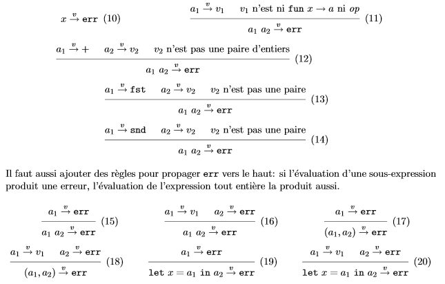
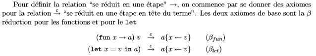
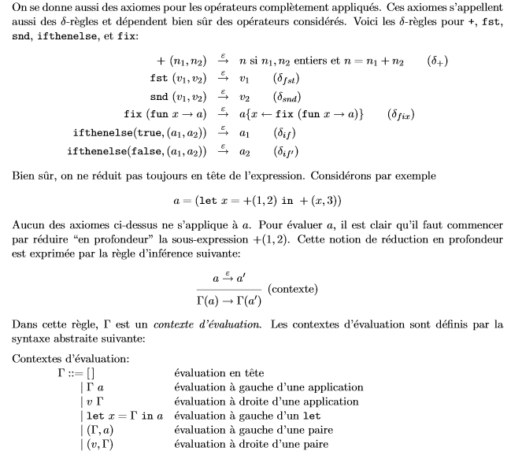

# Typage - Cours 2 : Sûreté du typage et sémantique à réduction

Le typage statique permet d'éliminer des programmes absurdes. Tout programme
bien typé s'évalue "sans problèmes" : c'est la **sûreté** du typage vis-à-vis
de l'évaluation.

## Distinction entre erreurs d'exécutions et non-terminaison

Les principaux problèmes pouvant surgir pendant l'évaluation sont :

* l'application d'une opération de base sur des arguments incorrects
* l'application d'une expression que ne s'évalue ni en une fonction, ni en
un opérateur (*1 2*)
* l'application d'un opérateur à un argument du mauvais type (*true + 1*)
* l'évaluation d'une variable libre (si le terme de départ n'est pas clos)

On ne veut pas tester explicitement à l'exécution si ces erreurs se
produisent.
Certains programment ne terminent pas, il ne suffit donc pas de vérifier qu'un
programme est bien typé pour déduire qu'il produit une valeur. On va en fait
introduire une constante **err**. pour signaler qu'une opération erronée s'est
produite.
On rajoute des règles d'évaluation pour détecter les erreurs :

On peut énoncer la propriété de sûreté du typage :
Si *a* est bien typée et *a→vr* alors *r≠err*.

Ainsi, une expression bien typée peut s'évaluer en une valeur, ou bien ne pas
terminer, mais jamais provoquer d'erreur d'exécution.

## Sémantique à réductions (petits pas)

La sémantique à réduction va décrire toutes les étapes du calcul.

**Rappels sur les contextes :**
Un **contexte** est une expression avec un "trou", noté *[]* (par exemple,
*+([],2)* ).
L'opération de base sur un contexte *C* est l'application *C(a)* à une
expression *a*.
*C(a)* est l'expression dénotée par *C* où le trou *[]* a été remplacé par *a*.
Ainsi, *+([],2)* appliquée à *1* donne *+(1;2)*.
