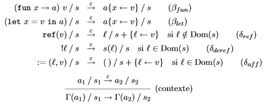
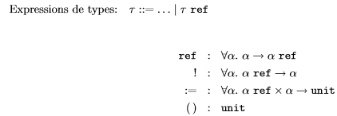
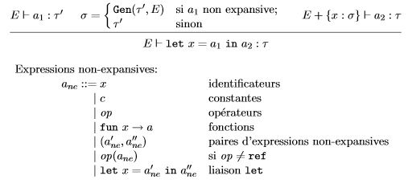
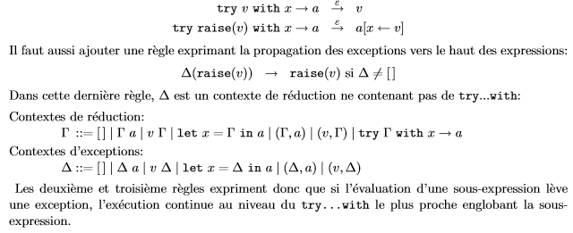
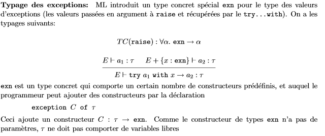

# Typage - Cours 5 : Programmation impérative

## Références

Une **référence** est une cellule d'indirection modifiable en place.  
On en crée une avec la construction **ref(a)**. Pour avoir le contenu d'une
référence, on a l'opérateur préfixe **!**. Enfin, on peut changer le contenu
par affectation (*a1 := a2*).  

## Sémantique à réduction pour les références

Dans un langage impératif, la valeur ne dépend plus que des valeurs de ses
variables libres : on ne peut pas évaluer les sous-expressions indépendamment
car certaines peuvent modifier des références.  
Pour étendre la sémantique à réduction, on a besoin des notions d'adresses
mémoire (notées *l*) et d'états mémoire (*s*, fonction partielle des
  adresses mémoires dans les valeurs).  

```
a ::= ...  (Expressions)
    | l  [adresse mémoire]
v ::= fun x->a  [valeurs fonctionnelles] (Valeurs)
    | c  [valeurs constantes]
    | op  [primitives non appliquées]
    | (v1, v2)  [paires]
    | l  [adresse mémoire]
```
On doit redéfinir la relation de réduction : **a/s → a'/s'** (dans l'état
mémoire *s*, l'expression *a* se réduit en *a'*, donnait l'état mémoire *s'*).  
Il y a de nouvelles règles :  
  
Les opérateurs purs (arithmétique, *fst*, *fix*...) se traduisent sans modifier
l'état mémoire.

## Typage des références

On doit évidemment étendre l'algèbre des types :  

Sauf que ce typage n'est pas sûr avec le polymorphisme ML :  
```
let r=ref(fun x->x) in // r a le type polymorphe (α -> α) ref
  r := (fun x->+(x,1)); // r se type avec l'instance (int -> int) ref
  (!r) true  // r se type avec l'instance (bool -> bool) ref
// typage OK, réduction bloquée.
```
On doit restreindre le typage statique pour garantir la propriété :  
*Lors du typage de ```let x=a in b```, on ne généralise pas dans le type de
*a*, les variables de types qui pourraient apparaitre dans le type d'une
référence allouée lors de l'évaluation de *a*.*

## Restriction de la généralisation

On ne va généraliser que les types des expressions **non-expansives**, celles
dont la forme garantit que l'évaluation ne crée pas de référence :  
  

## Les exceptions

On étend encore le langage :
```
a ::= ... | try a1 with x->a2  (Expressions)
op ::= ... | raise  (Opérations)
```
```raise``` interrompt l'évaluation courante, on lui passe un argument.

Règles de réduction pour *try .. with* :  
  
   
  
