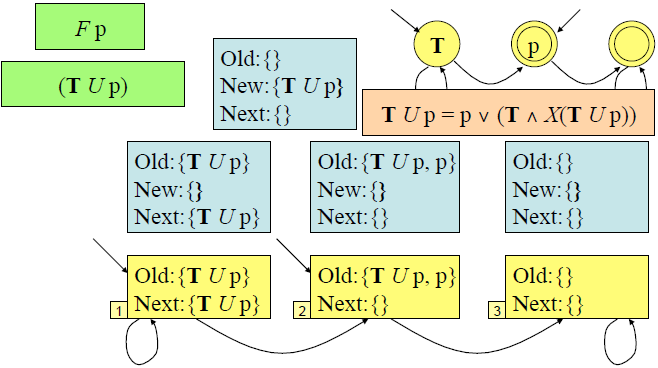
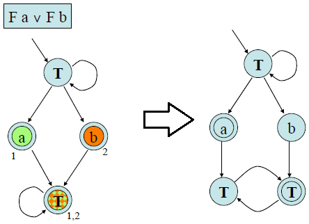

# Vérification - Cours 6 : Model-checking avec LTL

On veut vérifier **automatiquement** que le programme (modèle) implémente sa
spécification (*M ⊨ S*).  
Les pré-conditions pour appliquer le model-checking :

- la sémantique du programme suit un modèle fini
- la spécification suit un modèle fini ou une formule
- les algorithmes et outils pour vérifier retournent des diagnostiques
d'erreurs, simulent...

## Modèles

### Systèmes de transition étiquetés (STE)

On a un ensemble fini d'états (*S*) reliés par des transitions (dans *&Delta; ⊆
  S⨯L⨯S*, où *L* est l'ensemble des étiquettes.  
*I ⊆ S* est l'ensemble des états initiaux.

### Système de Kripke

Sur un ensemble *P* de propriétés, on a un STE mais pas d'ensemble
d'étiquettes. On utilise à la place une *fonction d'étiquettage*
&lambda; : S &rarr; 2P.

## Vu des algorithmes de model-checking

### Explicite

L'algorithme **explicite** regarde tous les états du modèle pour voir si la
formule est satisfaite. Il va étiqueter les états avec les formules
qui y sont satisfaites.

### Symbolique

L'algorithme **symbolique** ne manipule pas les états uns par uns, mais en les
mettant dans des ensembles, qu'il faut représenter *symboliquement*. Il se
base sur des diagrammes de décision binaires ou des matrices de différences.

## Automate de Büchi

Les automates de Büchi acceptent des traces infinies (ils ne sont donc pas
  déterministes).  
C'est un quadruplet ⟨S, I, δ F⟩ avec :

- S est un ensemble fini d'états
- I ⊂ S est l'ensemble des états initiaux
- δ ⊆ S⨯S est l'ensemble des transitions
- F ⊆ S est l'ensemble des états accepteurs

Une séquence infinie est acceptée si elle passe **un nombre infini de fois**
dans un état accepteur.

### Automate de Büchi étiquetté

Soit un ensemble de **propositions atomiques** P. On définit la fonction
d'étiquettage &lambda; : S &rarr; 2P. A chaque état est assigné un
ensemble de propositions qui sont vraies (les autres sont fausses).

## Model-checking

Soit un modèle M et une formule LTL Φ :

- **toutes les traces** de M doivent satisfaire Φ
- si une trace de M ne satisfait pas Φ, on a un *contre-exemple*
- ΣM est **l'ensemble des traces** de M
- ΣΦ est l'ensemble des traces **qui satisfont** Φ

ΣM &sube; ΣΦ

Soit un modèle M et une formule LTL Φ :

- on **construit** l'automate de Büchi B¬Φ
- on **calcule le produit** de M et B¬Φ :
  + chaque état de M est étiqueté avec des propositions
  + chaque état de B¬Φ est étiqueté avec des propositions
  + on fait correspondre les états avec les mêmes étiquettes
  + le produit (qui est un automate de Büchi) **accepte** les traces de M qui
    sont aussi des traces de B¬Φ
- on vérifie si le produit accepte toute séquence : on a trouvé un
*contre-exemple*.

Les séquences acceptées doivent **contenir un cycle** qui passe par **au
moins 1 état accepteur**.  
Le parcours est fait en *profondeur d'abord* : si en partant d'un état
acceptant, on retourne sur ce même état acceptant, on a trouvé un cycle.

### Génération d'automate de Büchi

On veut une procédure pour créer un automate de Büchi depuis une formule LTL.
Celui doit être **efficace** : les formules sont habituellement petites,
l'automate va être exponentielle à la taille de la formule, et le
model-checking est **polynomial** à la taile de l'automate.  

### Approche

- Réécriture de formule : on écrit les formules de **FNN** (Forme Normale
  Négative) et on applique les règles de réécriture
- Traduction : change la formule LTL en un **automate de Büchi généralisé**
- Dégénéralisation : change un automate de Büchi généralisé en *automate de
Büchi*

### Réécriture des formules

Forme Normale négative : la négation n'apparait que **devant** les
littéraux. On utilise les identités suivantes :

- ¬¬Φ = Φ
- ¬□Φ = ◇¬Φ
- ¬◇Φ = □¬Φ
- ¬(Φ&#120088;Ψ) = (¬Φ)V(¬Ψ)
- ¬(ΦVΨ) = (¬Φ)&#120088;(¬Ψ)

**V** (ou **R**) est l'opérateur **Release**, le dual d'**Until** :  
*ΦVΨ &equiv; &not;(&not;Φ&#120088;¬Ψ)*.

### Automate généralisé

Un automate de Büchi **généralisé** est un automate de Büchi avec **plusieurs
ensembles** d'états accepteurs.  
C'est un quadruplet ⟨S, I, δ F⟩ où
F = {F1, ..., Fn} ⊆ 2S est l'ensemble des
ensembles accepteurs.  
Une **séquence infinie d'états** est acceptée ssi elle contient infiniment
souvent **chaque** état de **chaque** ensemble accepteur.  

### Traduction

On utilise les équations de récurrence pour n'avoir que &and;, &or;, &#120088;,
et *V* :  

- Φ&#120088;Ψ = Ψ&or;(Φ&and;○(Φ&#120088;Ψ))
- ΦVΨ = Ψ&and;(Φ&or;○(ΦVΨ))
- ◇Φ = true&#120088;Ψ
- □Φ = ¬(◇¬Φ)

On a besoin de *V* car on veut une FNN, donc des négations uniquement devant
les propositions atomiques.  

### Construction de l'automate généralisé

On va construire les noeuds en suivant 3 ensembles de formules :

- *Old* : formules déjà satisfaites dans le noeud
- *New* : formules à satisfaire
- *Next* : formules qui doivent être satisfaites dans un successeur

A l'état initial, *Old = {}, New = {Φ}, Next = {}*.  
On fait l'**expansion** jusqu'à ce que *New = {}*, on obtient un état.

#### Expansion

On choisit une formule de **New**, qu'on retire puis on applique :

- une formule atomique passe directement dans **Old**
- Φ&or;Ψ : on divise le noeud en deux. L'un avec *New'=New∪{Φ}*, l'autre avec
*New'=New∪{Ψ}*  
- ΦVΨ : on divise le noeud en deux. L'un avec *New'=New∪{Ψ}* et
*Next'=Next∪{ΦVΨ}*, l'autre avec *New'=New∪{Φ,Ψ}* et *Next'=Next*
- Φ&#120088;Ψ : on divise en deux. L'un avec *New'=New∪{Φ}* et
*Next'=Next∪Φ&#120088;Ψ*, l'autre avec *New'=New∪{Ψ}* et *Next'=Next*

Si un noeud n'a pas de formule dans *New*, on crée un noeud avec toutes les
formules *Next* et on fait une transition entre eux. Puis on regarde si il y a
un état équivalent (même *Old* et *Next*).  
Les états accepteurs sont ceux qui contiennent à la fois une formule *Until*
et sa partie droite.

#### Exemple

### Dégénéralisation

On considère autant de copies de l'automate qu'il y a d'ensembles accepteurs.  
On remplace les transitions arrivant d'états accepteurs à la *prochaine*
copie.  
Chaque cycle doit traverser chaque copie. Chaque cycle doit contenir les états
accepteurs de chaque ensemble accepteur.

#### Exemple

